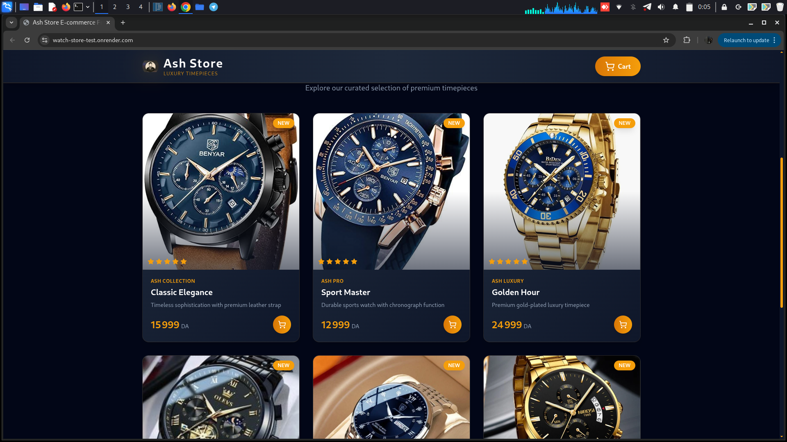
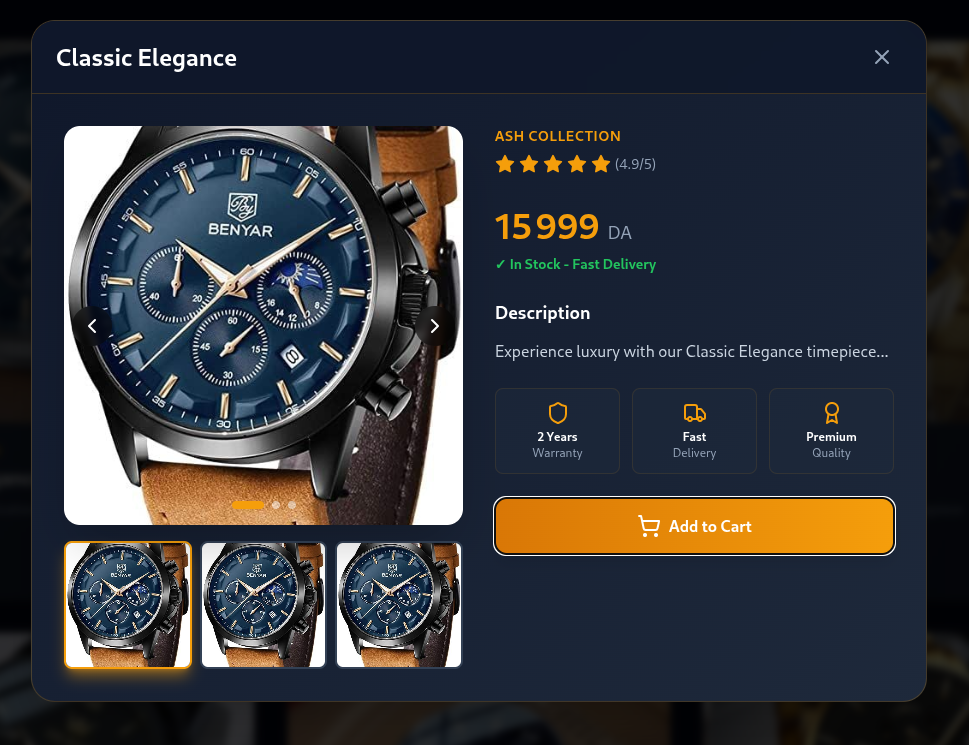
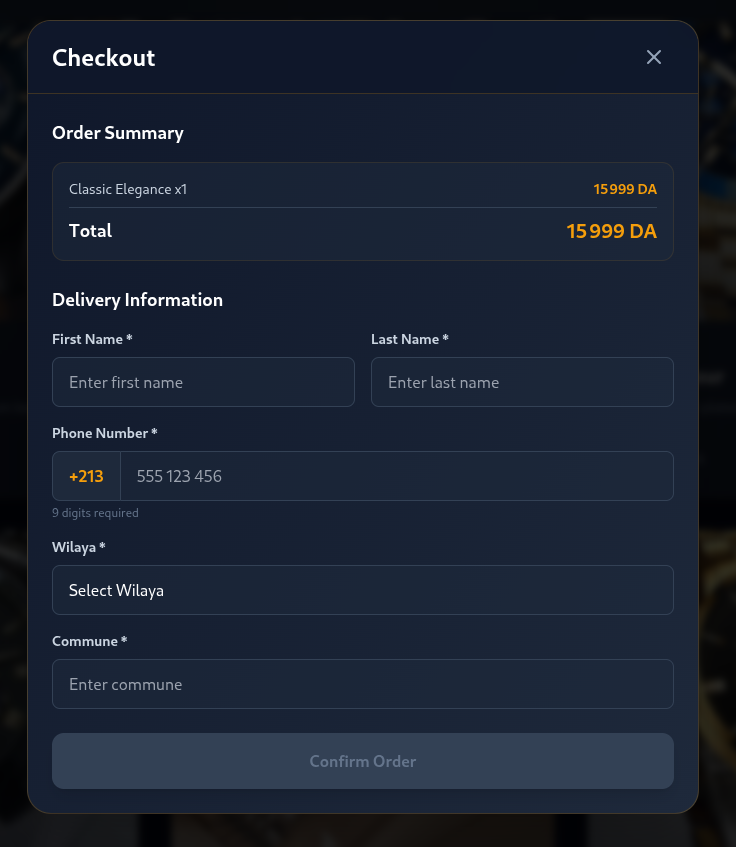

# E-commerce Watch Store

A modern and responsive **E-commerce Frontend** for showcasing and
selling luxury watches.\
Built with **TypeScript**, **React**, **TailwindCSS**, and **Vite** ---
optimized for speed, simplicity, and a clean user experience.

🌐 **Live Demo:** https://watch-store-test.onrender.com/

------------------------------------------------------------------------

## 📸 Screenshots

### 🏠 Home Page



### ⌚ Product Details



### 🛒 Cart View



------------------------------------------------------------------------

## 📁 Project Structure

    .
    ├── dist
    │   ├── assets
    │   │   ├── index-Bh-A3oiB.css
    │   │   └── index-CEDfa-0N.js
    │   ├── index.html
    │   ├── logo.png
    │   ├── logo-v2.png
    │   └── products
    │       ├── watch1.jpg
    │       ├── watch2.jpg
    │       ├── watch3.jpg
    │       ├── watch4.jpg
    │       ├── watch5.jpg
    │       └── watch6.jpg
    ├── eslint.config.js
    ├── index.html
    ├── package.json
    ├── package-lock.json
    ├── postcss.config.js
    ├── public
    │   ├── logo.png
    │   ├── logo-v2.png
    │   └── products
    │       ├── watch1.jpg
    │       ├── watch2.jpg
    │       ├── watch3.jpg
    │       ├── watch4.jpg
    │       ├── watch5.jpg
    │       └── watch6.jpg
    ├── screen_shot
    │   ├── 1.png
    │   ├── 2.png
    │   └── 3.png
    ├── src
    │   ├── App.tsx
    │   ├── components
    │   │   ├── CartModal.tsx
    │   │   ├── CheckoutModal.tsx
    │   │   ├── Footer.tsx
    │   │   ├── Header.tsx
    │   │   ├── Hero.tsx
    │   │   ├── ProductCard.tsx
    │   │   └── ProductModal.tsx
    │   ├── context
    │   │   └── CartContext.tsx
    │   ├── data
    │   │   ├── products.ts
    │   │   └── wilayas.ts
    │   ├── index.css
    │   ├── main.tsx
    │   ├── types
    │   │   └── index.ts
    │   └── vite-env.d.ts
    ├── tailwind.config.js
    ├── tsconfig.app.json
    ├── tsconfig.json
    ├── tsconfig.node.json
    └── vite.config.ts

------------------------------------------------------------------------

## 🚀 Features

-   🛒 Fully functional cart system\
-   💳 Checkout modal\
-   📦 Dynamic product listing\
-   🖼 Clean UI with TailwindCSS\
-   ⚡ Fast loading thanks to Vite\
-   📱 100% Responsive

------------------------------------------------------------------------

## 🛠️ Tech Stack

-   **React + TypeScript**\
-   **TailwindCSS**\
-   **Vite**\
-   **Context API** (State management)

------------------------------------------------------------------------

## 📊 Code Languages Breakdown

    TypeScript  95.2%
    JavaScript   2.2%
    CSS          1.3%
    HTML         1.3%

------------------------------------------------------------------------

## 📦 Installation

``` bash
git clone https://github.com/achraf-mehloul/watch_store_test
cd watch_store_test
npm install
npm run dev
```

------------------------------------------------------------------------

## 🏗 Build for Production

``` bash
npm run build
```

------------------------------------------------------------------------

## 📄 License

This project is free to use and modify.\
All images are for demonstration purposes only.
